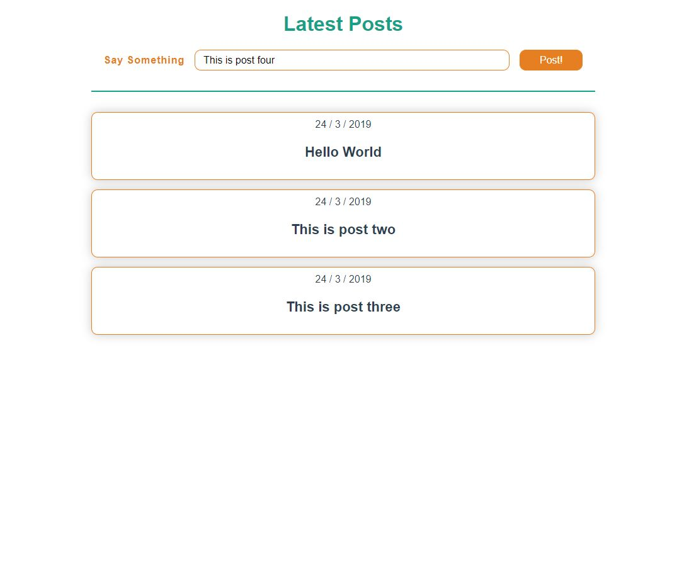

# Vue-Express-MongoDB app

> Application that brings posts in the mongoDB database and new post to database

## Quick Start

```bash
# Install dependencies server/client
cd server
npm install

cd client
npm install

# Serve on localhost:5000
npm run dev

# Vue App on localhost:8080
npm run client
```

### App screenshot


